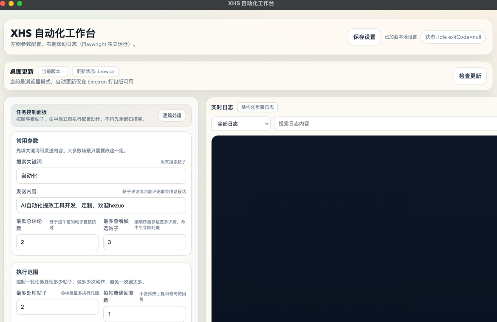
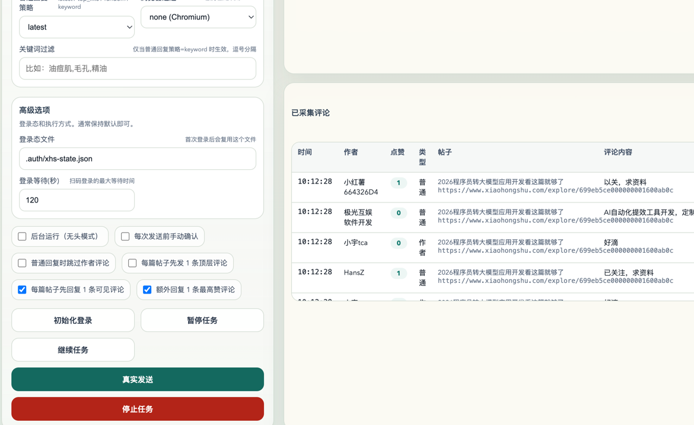

# 小红书自动化

一个基于 **Playwright + Electron** 的桌面自动化工具，核心目标是把“小红书搜索、帖子检查、评论采集、评论发送、桌面控制”整合到一个可直接分发的应用里。

这个 README 主要说明：**当前项目支持哪些功能**。

## 支持的功能

### 1. 关键词搜索帖子

- 支持输入关键词搜索帖子
- 支持从搜索结果中抓取候选帖子
- 支持按顺序逐篇检查候选帖子
- 支持控制“最多查看多少篇候选帖子”

### 2. 帖子筛选

- 支持按最低总评论数筛选帖子
- 支持命中后立即处理，不再先全部扫描完再统一执行
- 支持控制“最多处理多少篇帖子”
- 支持过滤重复帖子，避免同一帖子重复处理

### 3. 评论采集

- 支持进入帖子后采集评论区内容
- 支持在评论区滚动抓取更多评论
- 支持采集主评论和子评论
- 支持提取评论正文、作者、点赞数、时间、作者标记等信息
- 支持把采集到的评论输出到前端表格
- 支持在日志中打印评论采集明细

### 4. 帖子评论

- 支持进入帖子后直接发送 1 条顶层评论
- 支持通过开关控制是否启用这个动作
- 支持自定义评论内容
- 支持把“进入帖子先发评论”作为执行流程的一部分

### 5. 评论回复

- 支持回复当前可见评论
- 支持回复最高赞评论一次
- 支持普通评论回复
- 支持按配置控制每篇帖子最多回复多少条
- 支持跳过作者评论
- 支持包含作者评论
- 支持按策略选择回复目标

当前已支持的回复相关能力包括：

- 每篇帖子先回复 1 条可见评论
- 每篇帖子先发 1 条顶层评论
- 回复最高赞评论一次
- 普通评论回复

### 6. 回复策略

- 支持按最新评论回复
- 支持按最高赞评论回复
- 支持关键词匹配回复
- 支持配置回复关键词
- 支持设置单轮最大动作数
- 支持设置发送间隔，降低连续操作频率

### 7. 登录态管理

- 支持首次登录后保存登录态
- 支持后续运行复用登录态
- 支持指定登录态文件路径
- 支持初始化登录模式
- 支持登录等待超时配置
- 支持登录状态检测

### 8. 风控保护

- 支持发送间隔控制
- 支持单轮动作上限
- 支持人工确认发送
- 支持检测异常状态后停止
- 支持在日志中输出失败原因和阶段信息

### 9. 桌面控制台

- 支持 Electron 桌面应用
- 支持 macOS / Windows 打包分发
- 支持图形化任务参数配置
- 支持保存设置
- 支持恢复本地保存的设置
- 支持任务启动、暂停、继续、停止
- 支持实时日志查看
- 支持日志筛选和搜索
- 支持评论采集表格展示

### 10. 命令行运行

- 支持命令行直接运行自动化任务
- 支持无头模式
- 支持有头模式
- 支持浏览器通道切换
- 支持独立初始化登录

### 11. 自动更新

- 支持 Electron 桌面应用自动更新
- 支持启动后自动检查更新
- 支持检测到新版本后自动下载
- 支持下载进度展示
- 支持下载完成后重启安装
- 支持 macOS / Windows 更新产物
- 支持静态服务器更新源

## 当前项目形态

项目目前已经具备下面这套完整链路：

1. 桌面界面配置任务参数
2. 启动 Playwright 自动化
3. 搜索并检查帖子
4. 命中帖子后执行评论动作
5. 采集评论并展示在界面
6. 输出详细日志
7. 打包为桌面应用
8. 后续支持自动更新  